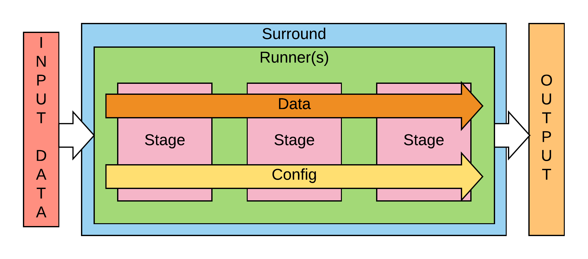

# Surround

Surround is a lightweight framework for serving machine learning pipelines in Python. It is designed to be flexible, easy to use and to assist data scientists by focusing them on the problem at hand rather than writing glue code. Surround began as a project at the Applied Artificial Intelligence Institute to address the following problems:

* The same changes were required again and again to refactor code written by data scientists to make it ready for serving e.g. no standard way to run scripts, no standard way to handle configuration and no standard pipeline architecture.
* Existing model serving solutions focus on serving the model rather than serving an end-to-end solution. Our machine learning projects require multiple models and glue code to tie these models together.
* Existing serving approaches do not allow for the evolution of a machine learning pipeline without re-engineering the solution i.e. using a cloud API for the first release before training a custom model much later on.
* Code was commonly being commented out to run other branches as experimentation was not a first class citizen in the code being written.

**Note:** Surround is currently under heavy development!

## Components
Here are some components in this library that you can use to build Surround solution. 

1. Surround
A group of many stages (or it can be 1 stage) to transform data into more meaningful data. You can set the order of stages directly on your implementation or via a config file. The config file allows you to define more than 1 pipeline implementation and then you can switch between them easily.

2. Surround Data
A sharable object between stages that holds necessary information for each stage. A stage will read some information from Surround Data, process it, then put back new information that will be used by other stage(s). When you extend this class, you can add as many variables as you need to help you transform input data into output data. But there are 4 core variables that are ready for you to utilise:
* **stage_metadata** is information that can be used to identify a stage.
* **execution_time** is recorded time to complete a process.
* **errors** is information to identify failure of a stage.
* **warnings** is information when transformation is not 100% right.

3. Stage
An implementation of data transformation. Here is where Surround Data is modified to achieve the result that you need. Each stage is only aimed to perform a set of related action. 1st stage can be a stage where you prepare data to be processed and last stage can be where your populate data to be sent back to the user.
* **operate** is a function that you need to override when you extend stage class. It should contain data transformation implementation.

4. Runner (optional) ***Implementation is coming later***
An interface to connect Surround to/from data. If you need to have this now, please look at [file adapter](examples/file-adapter) and [web server](examples/web-server) examples for implementation.

## When to use Surround?

* You want a flexible way to serve a pipeline in Python without writing C/C++ code.
* You have multiple models (custom or pre-trained) from different frameworks that need to be combined into a single Surround solution.
* You want to use existing intelligent APIs (AWS Rekognition, Google Cloud AI, Cognitive Services) as part of your Surround implementation.
* You have pre or post processing steps that aren't part of your models but need to be deployed as part of your Surround implementation.
* You need to package up your dependencies for running Surround as an offline solution on another machine.

## Installation

Tested on Python 3.6.5

* Clone this repository
* Navigate to the root directory
* `python3 setup.py install`

To run the tests: `python3 setup.py test`

## A Simple Example

A short explanation is provided in the hello-world example's [README](examples/hello-world/) file.
```python
from surround import Stage, SurroundData, Surround
import logging

class HelloStage(Stage):
    def operate(self, data, config):
        data.text = "hello"

class BasicData(SurroundData):
    text = None

if __name__ == "__main__":
    logging.basicConfig(level=logging.INFO)
    surround = Surround([HelloStage()])
    output = surround.process(BasicData())
    print(output.text)
```

## Command Line
You can use command line to generate a new project or a tutorial.

- To list more information: `surround -h`
- To generate tutorial: `surround tutorial <path-to-dir>`
- To generate project: `surround init <path-to-dir>`
  - Use `-p` or `--project-name` to specify name: `surround init <path-to-dir> -p sample`
  - Use `-d` or `--description` to specify description: `surround init <path-to-dir> -p sample -d sample-project`
- To run a Surround project: `surround run <project doit task>`. Note the Surround project must have a `dodo.py` file with tasks for this command to work.

## Examples

See the [examples](https://github.com/dstil/surround/tree/master/examples) directory.

## Contributing

For guidance on setting up a development environment and how to make a contribution to Surround, see the [contributing guidelines](docs/CONTRIBUTING.md).


## License

Surround is released under a [BSD-3](https://opensource.org/licenses/BSD-3-Clause) license.

## Release (only for admin)
1. Tag repo with a version that you want this to be released with.
2. Push to tag to master.
