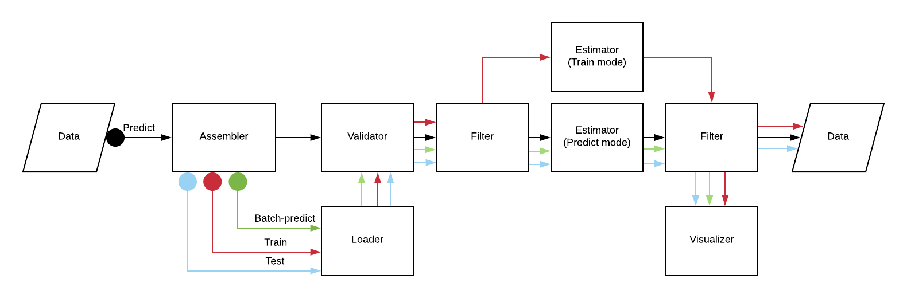

<p align="center">
    
</p>

Surround is a lightweight framework for serving machine learning pipelines in Python. It is designed to be flexible, easy to use and to assist data scientists by focusing them on the problem at hand rather than writing glue code. Surround began as a project at the [Applied Artificial Intelligence Institute](https://a2i2.deakin.edu.au) to address the following problems:

* The same changes were required again and again to refactor code written by data scientists to make it ready for serving e.g. no standard way to run scripts, no standard way to handle configuration and no standard pipeline architecture.
* Existing model serving solutions focus on serving the model rather than serving an end-to-end solution. Our machine learning projects require multiple models and glue code to tie these models together.
* Existing serving approaches do not allow for the evolution of a machine learning pipeline without re-engineering the solution i.e. using a cloud API for the first release before training a custom model much later on.
* Code was commonly being commented out to run other branches as experimentation was not a first class citizen in the code being written.

### Used in projects by:


## Installation

### Prerequisites
- [Python](https://www.python.org/) 3+ (Tested on 3.6.5)
- [Docker](https://www.docker.com/) (required for running in containers)
- [Tornado](https://www.tornadoweb.org/en/stable/) (optional, needed if serving via Web)

Use package manager [pip](https://pip.pypa.io/en/stable/) to install the latest (stable) version:
```
$ pip3 install surround
``` 

## Simple usage

A short explanation is provided in the hello-world example's [README](examples/hello-world/) file.
```python
import logging
from surround import SurroundData, Validator, Estimator, Assembler

class HelloWorld(Estimator):
    def estimate(self, surround_data, config):
        surround_data.text = "Hello world"

    def fit(self, surround_data, config):
        print("No training implemented")

class ValidateData(Validator):
    def validate(self, surround_data, config):
        if surround_data.text:
            raise ValueError("'text' is not None")

class BasicData(SurroundData):
    text = None

if __name__ == "__main__":
    logging.basicConfig(level=logging.INFO)
    data = BasicData()
    assembler = Assembler("Hello world example", ValidateData(), HelloWorld())
    assembler.run(data)
    print("Text is '%s'" % data.text)
```

## Command Line Usage
Surround comes with a range of command line tools to help you create and run Surround pipelines.

To get more information on these tools, run the following command:
```
$ surround -h
```

### Generating projects
For example you can use the sub-command ``init`` to generate a new project:
```
$ surround init <path-to-dir> --project-name sample --description "Sample description" --require-web
```

Where a new folder in `path-to-dir` (current directory if left blank) will be created with the name of the project. In this folder will be a collection of scripts and folders typically needed for a Surround project. For more information on what is generated, see our [Getting Started](https://surround.readthedocs.io/getting-started.html) guide.

### Running projects
You can then test the genereated pipeline using the `run` sub-command in the root of the project like so:
```
$ surround run batch_local
```

This will execute the pipeline locally in batch mode. If you want to run the pipeline in a container then use the following:
```
$ surround run build
$ surround run batch
```

If you would like to serve your pipeline via Web endpoints (`--require-web` is required when generating for this option) then you can use:
```
$ surround run web
```
Which (by default) will accept input data as JSON via HTTP POST to the endpoint `http://localhost:8080/estimate` in the following format:
```
{ "message": "this data will be processed by the pipeline" }
```

To see a full list of the available tasks just run the following command:
```
$ surround run
```

For more information on different run modes and when/how they should be used see both our [About](https://surround.readthedocs.io/about.html) and [Getting Started](https://surround.readthedocs.io/getting-started.html) pages.

## Surround pipeline architecture
The following diagram describes how data flows through a Surround pipeline depending on the mode used when running.



For a more in-depth description of this diagram, see the [About](https://surround.readthedocs.io/about.html) page on our website.

## Examples

See the [examples](https://github.com/dstil/surround/tree/master/examples) directory for useful examples on how Surround can be utilized.

## Full Documentation
See [our website](https://surround.readthedocs.io/) for an in-depth explanation of Surround (in the About page), a Getting Started Guide, and full documentation of the API.

## Contributing

For guidance on setting up a development environment and how to make a contribution to Surround, see the [contributing guidelines](docs/CONTRIBUTING.md).


## License

Surround is released under a [BSD-3](https://opensource.org/licenses/BSD-3-Clause) license.

## Project Status
Surround is currently under **heavy** development, please submit any issues that occur or suggestions you may have, it is very much appreciated!
